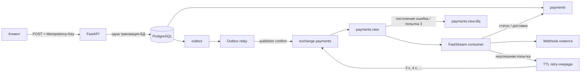

# Async Payment Processing Service

## Архитектура



Ключевые гарантии доставки:

- Платёж и outbox-событие `payment.created` создаются атомарно
- Relay выбирает неопубликованные строки с `FOR UPDATE SKIP LOCKED`, отправляет
  persistent-сообщения с publisher confirm и выставляет `published_at` только после
  подтверждения брокера
- Если процесс упал после подтверждения RabbitMQ, но до коммита PostgreSQL, возможна
  повторная публикация. Это неизбежная граница outbox; consumer намеренно сделан
  идемпотентным
- После выхода платежа из `pending` шлюз больше не вызывается. Ошибка webhook
  повторяет только доставку webhook, а не обработку платежа
- Webhook доставляется с гарантией at-least-once. `X-Webhook-Event-ID` остаётся
  одинаковым при повторах, поэтому получатель может дедуплицировать события
- Временные ошибки проходят через durable TTL retry-очереди с экспоненциальными
  задержками. После трёх общих попыток сообщение попадает в `payments.new.dlq`,
  а постоянные ошибки направляются туда сразу с диагностическими заголовками
- `X-Request-ID` проходит через payload outbox, RabbitMQ headers, логи consumer и
  заголовки webhook

## Запуск

Требования: Docker и Docker Compose v2+.

```bash
cp .env.example .env
# Для любого общего окружения задайте в .env нестандартный API_KEY
docker compose up --build -d
docker compose ps
```

API доступен по адресу `http://127.0.0.1:8000`. Интерфейс управления RabbitMQ:
`http://127.0.0.1:15672` (`payments` / `payments`). Порты PostgreSQL и AMQP намеренно
не публикуются на хост

Контейнер API применяет миграции Alembic перед запуском. Consumer стартует только
после успешных healthcheck API, PostgreSQL и RabbitMQ

Остановить сервисы, сохранив данные:

```bash
docker compose down
```

Полностью очистить окружение:

```bash
docker compose down -v
```

## API

Каждый прикладной HTTP endpoint требует заголовок `X-API-Key`. Динамический Swagger UI
доступен на русском по адресу `http://127.0.0.1:8000/docs`, а на английском — по адресу
`http://127.0.0.1:8000/docs/en`. Их OpenAPI-схемы: `http://127.0.0.1:8000/openapi.json` и
`http://127.0.0.1:8000/openapi.en.json`. В Swagger UI перед выполнением запроса нажмите
**Authorize** и укажите `X-API-Key`.

OpenAPI-схема строится FastAPI непосредственно из актуальных маршрутов, зависимостей,
Pydantic-моделей и response-моделей. Русская и английская версии используют один
сгенерированный контракт; локализуются только отображаемые тексты. Отдельной вручную
поддерживаемой спецификации нет: после перезапуска приложения (или при `uvicorn --reload`
в локальной разработке) изменения кода автоматически появляются в обоих Swagger UI
Локализация находит операции по стабильному `operation_id`, а component schemas — по
сгенерированным `$ref`, поэтому пути маршрутов и имена Python-моделей не дублируются
в слое переводов

Создание платежа:

```bash
curl -i http://127.0.0.1:8000/api/v1/payments \
  -H 'Content-Type: application/json' \
  -H 'X-API-Key: local-development-key' \
  -H 'X-Request-ID: order-42-request' \
  -H 'Idempotency-Key: order-42-attempt-1' \
  -d '{
    "amount": "125.50",
    "currency": "RUB",
    "description": "Order #42",
    "metadata": {"order_id": 42},
    "webhook_url": "http://webhook-sink:8080/success"
  }'
```

Ответ: `202 Accepted`.

Webhook из примера предоставляет локальный Compose-стенд. Consumer обращается к нему
по имени сервиса `webhook-sink` внутри Docker-сети

```json
{
  "payment_id": "d9250c54-0ea5-45b6-afc7-ab7eade852c5",
  "status": "pending",
  "created_at": "2026-07-15T09:00:00Z"
}
```

Отправка того же тела с тем же `Idempotency-Key` возвращает исходный платёж
Повторное использование ключа с изменённым телом возвращает `409 Conflict`.
Сравнение основано на каноническом SHA-256 fingerprint запроса, а уникальное
ограничение базы данных безопасно разрешает конкурентные запросы

Получение платежа:

```bash
curl http://127.0.0.1:8000/api/v1/payments/d9250c54-0ea5-45b6-afc7-ab7eade852c5 \
  -H 'X-API-Key: local-development-key'
```

Тело webhook:

```json
{
  "event_id": "e44130bf-643d-4bdc-92af-3e4714a3021b",
  "event_type": "payment.processed",
  "payment_id": "d9250c54-0ea5-45b6-afc7-ab7eade852c5",
  "status": "succeeded",
  "processed_at": "2026-07-15T09:00:04Z"
}
```

Timeout, ошибка соединения, HTTP 429 и HTTP 5xx считаются временными и повторяются
Небезопасный webhook URL, некорректное событие, отсутствующий платёж и остальные
HTTP 4xx считаются постоянными ошибками и сразу направляются в DLQ

## Поведение при сбоях

| Точка сбоя | Результат |
|---|---|
| RabbitMQ недоступен во время `POST` | Платёж и outbox-событие остаются зафиксированными; API продолжает работать, relay переподключается |
| Relay завершился до публикации | Неопубликованная строка будет обработана позднее |
| Relay завершился после публикации, но до отметки в БД | Возможен дубль сообщения; проверки состояния consumer делают его безопасным |
| Consumer завершился до коммита статуса | RabbitMQ повторно доставит сообщение; эмулятор не имеет внешнего побочного эффекта |
| Consumer получил дубль после коммита статуса | Шлюз пропускается; выполняется только недоставленный webhook |
| Webhook вернул 429 / 5xx или произошла транспортная ошибка | Текст ошибки и счётчик попыток сохраняются; сообщение уходит в экспоненциальный retry |
| Webhook вернул другой 4xx или URL небезопасен | Попытка сохраняется; сообщение сразу публикуется в `payments.new.dlq` |
| Третья временная ошибка подряд | Сообщение публикуется в `payments.new.dlq` с диагностическими заголовками |
| Consumer завершился после приёма webhook, но до отметки в БД | Webhook может быть продублирован; получатель дедуплицирует его по event ID |

Эмулированный шлюз ждёт 2–5 секунд и возвращает `succeeded` в 90% случаев или
`failed` в 10%. Бизнес-результат `failed` является корректным результатом обработки,
а не транспортной ошибкой, и также приводит к отправке webhook


## Конфигурация

См. [.env.example](.env.example). Основные параметры:

| Переменная | Значение по умолчанию | Назначение |
|---|---:|---|
| `API_KEY` | `local-development-key` | Локальный API-ключ; вне локальной разработки необходимо заменить |
| `DATABASE_URL` | URL локального PostgreSQL | Строка подключения SQLAlchemy async |
| `RABBITMQ_URL` | URL локального AMQP | Подключение FastStream к брокеру |
| `CONSUMER_MAX_ATTEMPTS` | `3` | Общее число попыток до DLQ |
| `CONSUMER_RETRY_BASE_SECONDS` | `2` | Первая TTL-задержка; следующие удваиваются |
| `WEBHOOK_TIMEOUT_SECONDS` | `10` | Общий timeout HTTP-клиента |
| `WEBHOOK_ALLOW_PRIVATE_HOSTS` | `false` | Явный локальный обход SSRF-защиты |
| `OUTBOX_BATCH_SIZE` | `100` | Размер пачки relay |
| `OUTBOX_POLL_INTERVAL_SECONDS` | `1` | Интервал idle polling и переподключения |

Если retry timing меняется в окружении, где RabbitMQ уже создал очереди, необходимо
удалить или переименовать такие очереди: RabbitMQ не позволяет менять аргументы
существующей очереди на месте
